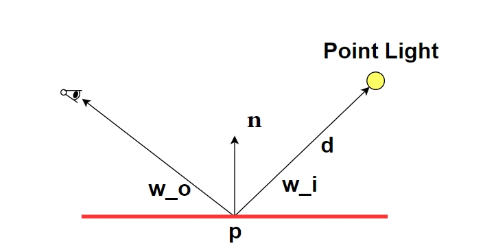

# 从渲染方程开始...
渲染方程描述了着色点沿一特定观察方向出射的光的总量与入射光和BRDF的关系。它来源于物理中的能量守恒定律，核心思想是出射光 = 自发光 + 反射光。1986年James Kajiya将之引入计算机图形学，概括了当时存在的一些渲染算法，例如分布式光线追踪和辐射度方法，并为后来的路径追踪等算法提供了直接的理论基础。在今天，渲染方程已经成为基于物理的渲染中各种复杂光照算法的出发点，让我们从学习渲染方程开始，一窥光照传输的门径。
## 辐射度量学
在基于物理的渲染中，我们需要一种方法对光进行量化。辐射度量学研究的是对电磁辐射的测量，与光线的物理传输过程紧密相关，渲染方程中出现的各个物理量就属于辐射度量学。这些物理量还需要光度学和色度学的知识，才会转化成我们熟悉的RGB颜色值。
| 名称            | 符号         | 单位          | 说明                                  |
|-----------------|--------------|---------------|---------------------------------------|
| Radiant Energy  | \( Q \)      | J（焦耳）      | 光的总能量，衡量光在一段时间内传递的能量       |
| Radiant Flux / Power | \( \Phi \)   | W（瓦特）      | 每秒传递的能量，即能量的时间导数              |
| Radiant Intensity | \( I \)      | W/sr         | 单位立体角方向的能量速率，适用于点光源等方向性分析 |
| Irradiance      | \( E \)      | W/m²          | 单位面积接收到的总flux                     |
| Radiance        | \( L \)      | W/(m²·sr)     | 单位面积单位立体角的flux，衡量单条光线亮度       |

表1 常见的辐射度量和单位

渲染中常用的辐射度量有energy、flux/power、intensity、irradiance和radiance（这几个物理量保留英文，不做翻译）。理解这几个物理量的含义是学习渲染方程的关键，下面我用一个例子展示它们的作用和区别。
### 例1

图1 一条由点光源、着色点、眼睛构成的简单光路

考虑图1中的情况：对于点光源，我们无法定义它的出射radiance（因为没有面积），但是它的flux（记为 $\Phi$）均匀分布在半径为 $d$的球面上，球面面积为 $4\pi d^2$。因此，球面上单位面积的flux（理想情况的irradiance）为 $\frac{\Phi}{4\pi d^2}$。再引入入射角的影响，着色点 $\mathbf{p}$接收到的irradiance为 $\frac{\Phi}{4\pi d^2} \cdot (n \cdot \omega_i)$。表面的反射作用由BRDF（记为 $f_r(p,\omega_i,\omega_o)$）建模。最终出射radiance为 $$\frac{\Phi}{4\pi d^2} \cdot (n \cdot \omega_i) \cdot f_r(p,\omega_i,\omega_o)$$，这也是眼睛接收到的radiance。 几个需要注意的问题： 1.点光源不是“物理”光源，是一种理想模型。它无法定义出射radiance，对于某一方向，可以用intensity，值为 $I=\frac{\Phi}{4\pi}$。此外这里的结果不用于渲染，点光源渲染中用到的光源属性是另一个话题 2.BRDF的定义是出射的radiance除以入射的irradiance，为了得到后者我们需要将入射光乘以 $cos\theta$。 3.radiance是一根光线的特性，着色点出射的radiance与到达眼睛的radiance是相等的，没有平方衰减，距离增加的效果是在屏幕中对应的像素减少。
## 渲染方程
场景是由一系列表面组成的，其中一些可以发光，成为radiance的来源。从表面上的点发出的光线的集合是以法线为中心的半球。这些光线携带的能量在传播过程中遵循的守恒定律就是渲染方程，这个方程不是推导出来的，也没有记忆压力，重要的是理解辐射度量和BRDF。根据不同的应用场景和计算需求，渲染方程可以表示为方向形式和表面形式。这两种形式在数学上是等价的，但它们在变量选择、积分域和物理含义上有所不同。
### 方向形式
$$\begin{cases} L_{\text{out}}(\mathbf{x}, \mathbf{v}_{\text{out}}) = L_e(\mathbf{x}, \mathbf{v}_{\text{out}}) + \iint_{H_\mathbf{x}} f(\mathbf{x}, \mathbf{v}_{\text{out}}, \mathbf{v}_{\text{in}}) L_{\text{in}}(\mathbf{x}, \mathbf{v}_{\text{in}}) \, d\sigma^\perp_{\mathbf{v}_{\text{in}}} \\ L_{\text{in}}(\mathbf{x}, \mathbf{v}_{\text{in}}) = L_{\text{out}}(\text{Cast}(\mathbf{x}, \mathbf{v}_{\text{in}})) \end{cases}$$
- $L_{out}$:从点 $\mathbf{x}$向 $\mathbf{v}_{out}$发出的光。
- $L_e$：点 $\mathbf{x}$在该方向上的自发光。
- 第二项是对所有入射方向 $\mathbf{v}_{in}$的积分，考虑了：
    - BRDF $f$：反射特性；
    - $L_{\text{in}}$：入射光；
    - $d\sigma^\perp$：半球投影面积微元。
- 第二行表示：入射光来自另一个点向该点射出的出射光。

图2 方向形式的渲染方程，统计半球上各个方向的入射radiance

更常见的写法可能是这样的： $$L_o(p, \omega_o) = L_e(p, \omega_o) + \int_{\Omega^+} L_i(p, \omega_i) f_r(p, \omega_i, \omega_o)(n \cdot \omega_i) \, d\omega_i$$  区别有以下两点： 1. $(n \cdot \omega_i) \, d\omega_i$和 $d\sigma^\perp$是一样的，只是不同资料记法上的区别。 2.第一种写法强调了入射radiance的来源，我觉得这点还是比较重要的。这个radiance可能来自面光源,IBL,或者其它表面反射的光。Cast函数返回自变量发射的光线打到的第一个点， $Cast(\mathbf{p}, \mathbf{d}) = (\mathbf{p}+t\mathbf{d}, -\mathbf{d})$，图2展示了这一点。

图3 Cast函数的作用，可以看到两个箭头方向相反（方向的习惯记法是着色点作为起点）

### 表面形式

图4 表面形式（也叫做三点形式）的渲染方程

几何项： $$G(p \leftrightarrow p') = V(p \leftrightarrow p') \frac{|\cos \theta| |\cos \theta'|}{\|p - p'\|^2}.$$
渲染方程： $$L(p' \rightarrow p) = L_e(p' \rightarrow p) + \int_A f(p'' \rightarrow p' \rightarrow p) \, L(p'' \rightarrow p') \, G(p'' \leftrightarrow p') \, dA(p'')$$
几何项的来源：将立体角积分转为面积积分， $d\omega = \frac{\cos\theta'}{\|p - p'\|^2} dA$。再考虑可见性和渲染方程中本来存在的入射光线与着色点表面法线的夹角余弦。

图5 立体角微元与面积微元的雅可比

### 方向形式和表面形式的区别
方向形式像用“手电筒”直接测量某个方向的亮度（radiance），不考虑radiance的来源，例如光源距离和遮挡，如果遮挡radiance就是零。在对BSDF，IBL采样，计算AO时通常会采用方向形式。面积形式像计算“整个房间的灯光照射到某点”的总能量（irradiance），依赖于两点之间的几何关系，必须考虑距离和角度衰减。路径积分，计算面光源的直接光照时会采用面积形式。
## 求解渲染方程
### 有解析解吗？
渲染方程的维度会随光路顶点数增加而增加（之后的路径追踪的笔记会展示这一点），通常只能用数值积分求解。只有在一些极端简单的光照条件下才有解析解，例如均匀光照、只算直接光照、特殊的光源和BRDF等等。我们不妨回顾一下例1，着色点 $\mathbf{p}$的法线半球上只有 $\omega_l$（这里的 $\omega_l$是例1中的 $\omega_i$）方向radiance不为零，可以写为 $$L_i(x, \omega_i) = \frac{I(\omega_l)}{d^2} \cdot \delta(\omega_i - \omega_l)$$，渲染方程 $$L_o(x, \omega_o) = \int_\Omega f_r(x, \omega_i, \omega_o) \cdot L_i(x, \omega_i) \cdot (\omega_i \cdot n) \, d\omega_i$$将上式中的 $L_i$ 换为点光源形式后： $$L_o(x, \omega_o) = f_r(x, \omega_l, \omega_o) \cdot \frac{I(\omega_l)}{d^2} \cdot (\omega_l \cdot n)$$这个结果与例1相同。
### 通用解法
先介绍一些概念：
#### 积分方程：
第一类积分方程 $$f(x) = \int k(x, x') g(x') dx'$$
第二类积分方程 $$f(x) = g(x) + \int k(x, x') f(x') dx'$$
显然渲染方程属于第二类积分方程。
#### 线性算子
线性算子作用于函数就像矩阵作用于向量 $$h(x) = (L \circ f)(x)$$线性性质 $$L \circ (a f + b g) = a(L \circ f) + b(L \circ g)$$ 线性算子的类型： 积分算子 $$(K \circ f)(x) \equiv \int k(x,x') f(x') dx'$$微分算子 $$(D \circ f)(x) \equiv \frac{\partial f}{\partial x}(x)$$有了以上概念，渲染方程可以改写为 $$L_{\text{out}} = L_e + \mathcal{T}(L_{\text{out}})$$ $$\Rightarrow (1 - \mathcal{T})L_{\text{out}} = L_e$$下面简单介绍两种求解方法，以后单独开文章。
#### 辐射度方法
- 渲染方程 $$(1 - \mathcal{T})L_{\text{out}} = L_e$$
- 辐射度有限元
    - 离散化4D光线空间（surface $\times$ hemisphere）到N个元素。
    - $L_e$， $L_{out}$都表示为N维向量。
    - $(1 - \mathcal{T})$变成矩阵
    - 求解线性系统

#### 光线追踪
- 渲染方程 $$(1 - \mathcal{T})L_{\text{out}} = L_e$$
- 光线追踪 $$L_{\text{out}} = (1 - \mathcal{T})^{-1} L_e$$ $$L_{\text{out}} = (1 + \mathcal{T} + \mathcal{T}^2 + \mathcal{T}^3 + \cdots) L_e$$

用Neumann级数展开渲染方程，物理意义是渲染结果是直接光照、一次间接光照、二次间接光照和更高次弹射的和。路径追踪使用蒙特卡洛积分数值计算，配合俄罗斯轮盘赌对这个无穷项和进行无偏估计。

## 核心假设与适用条件
1. **几何光学近似**  
   - 假设光以直线传播（波动效应如衍射、干涉忽略不计）。  
   - 适用于宏观场景（尺度远大于光波长）。  

2. **无透射的经典形式**  
   - 默认仅考虑表面反射与发射，**不包含透射**（需扩展为BSDF或BSSRDF模型）。  
   - 透射需引入额外项（如折射光线的贡献）。  

3. **无参与介质**  
   - 假设光在真空中传播，**忽略散射/吸收介质**（如雾、云、水）。  
   - 参与介质需引入体积渲染方程（含散射、吸收、发射项）。  

4. **稳态光场**  
   - 假设光场处于平衡状态（动态效应如荧光、时变介质需额外建模）。  
## 总结
渲染方程作为基于物理的渲染中光照模型的核心，不仅统一了直接光照与间接光照的表达方式，也为多种全局光照算法提供了理论框架。通过理解辐射度量学、BRDF 以及渲染方程的多种形式，我们能够更清晰地把握光照在场景中的传播机制。尽管渲染方程本身难以求解，其形式化表达却为近似计算提供了明确的方向。在后续的学习中，将深入路径积分与蒙特卡洛方法等数值求解技术，以进一步理解光照传输的复杂性与计算机图形学在“模拟真实”中的策略。