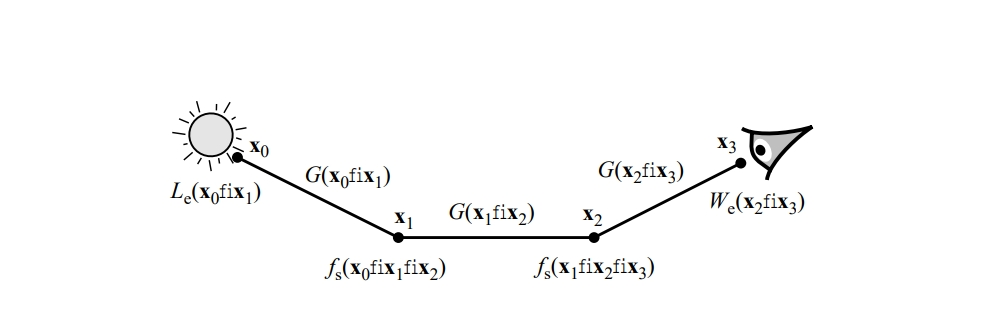

Foggy Landing by Brian Odgen

# 蒙特卡洛积分
蒙特卡洛积分是一种使用随机数的数值积分技术。与通常在均匀网格中计算积分的算法不同，蒙特卡洛积分的样本点是在被积函数定义域中随机选择的，这种方法对于高维积分尤其有用。  蒙特卡洛积分在网络上可以找到大量相关资料。如果你想从头开始系统地学习，我建议你在Google上找一篇综述文章阅读。蒙特卡洛积分在很多学科中都有身影，这篇笔记关心的是其在渲染上的应用，至于背后更深的数值积分和数理统计的知识我还不熟悉。下面的内容包括记号基本遵从Veach的thesis（<https://graphics.stanford.edu/papers/veach_thesis/>），对有些细节进行了增删。
## 背景
光照传输问题中的路径积分统一表达式：

\[
I_j = \int_{\mathcal{P}} f_j(\bar{p}) \, d\mu(\bar{p})
\]

其中：

- \(\mathcal{P}\) 是所有可能路径的空间，
- \(\bar{p}\) 是一条具体路径（包括所有中间散射点、方向等信息），
- \(f_j(\bar{p})\) 是路径的贡献函数（BRDF、几何项、发光项和重要性项的乘积），
- \(\mu(\bar{p})\) 是路径空间上的自然测度（包含位置和方向的积分密度）。

由于路径空间通常高维且复杂，因此使用**蒙特卡洛采样路径**来估计积分 \(I_j\) 是必要的。

### 例1

图1 贡献函数是许多项的乘积（图中是一条长度为3的路径）

在路径追踪中，我们可以把路径积分递归展开（详细内容放到对应笔记里。如果你不了解这部分知识没关系，不影响蒙特卡洛积分本身的学习）。

$$
\begin{aligned}
I_j &= \sum_{k=1}^{\infty} \int_{\mathcal{M}^{k+1}} L_e(x_0 \to x_1) G(x_0 \leftrightarrow x_1) \prod_{i=1}^{k-1} f_s(x_{i-1} \to x_i \to x_{i+1}) G(x_i \leftrightarrow x_{i+1}) \\
&\quad \cdot W^{(j)}_e(x_{k-1} \to x_k) \, dA(x_0) \cdots dA(x_k) \\
&= \int_{\mathcal{M}^2} L_e(x_0 \to x_1) G(x_0 \leftrightarrow x_1) W^{(j)}_e(x_0 \to x_1) \, dA(x_0) \, dA(x_1) \\
&\quad + \int_{\mathcal{M}^3} L_e(x_0 \to x_1) G(x_0 \leftrightarrow x_1) f_s(x_0 \to x_1 \to x_2) G(x_1 \leftrightarrow x_2) \\
&\quad \cdot W^{(j)}_e(x_1 \to x_2) \, dA(x_0) \, dA(x_1) \, dA(x_2) \\
&\quad + \cdots.
\end{aligned}
$$

可以看到这是个无穷维积分，物理意义是像素\(j\)接收到的光照可以分解为直接光照、一次间接光照、二次间接光照和更高次弹射的和。 此外该积分也不光滑：几何项中的可见性函数\(V(x,y)\)（当两点间无遮挡时为1，否则为0）是典型的不连续函数，会在遮挡边界处产生阶跃；BRDF中例如镜面反射的Delta分布、微表面模型中的高光波瓣，会在特定方向产生能量集中，导致被积函数出现尖峰；面光源的锐利边界也会引入不连续性。

## 数值积分的求积公式（Quadrature rules）
| 方法             | 基本公式                                                                                      | 收敛速度  | 要求连续性 | 特点                         |
|------------------|---------------------------------------------------------------------------------------------|-------------------------|------------|------------------------------|
| 中点法 (Midpoint) | \(\int_a^b f(x)dx \approx (b-a)f\left(\frac{a+b}{2}\right)\)                                   | \(O(n^{-2})\)           | \(f \in C^1\) | 简单粗糙，适合初步估计            |
| 梯形法 (Trapezoidal) | \(\int_a^b f(x)dx \approx \frac{b-a}{2}\left(f(a)+f(b)\right)\)                              | \(O(n^{-2})\)           | \(f \in C^2\) | 适合光滑函数，小步长效果好        |
| Simpson法 (Simpson's) | \(\int_a^b f(x)dx \approx \frac{b-a}{6}\left(f(a) + 4f\left(\frac{a+b}{2}\right) + f(b)\right)\) | \(O(n^{-4})\)           | \(f \in C^4\) | 高效且常用，需要偶数段数            |
| Gauss–Legendre法 (Gauss-Legendre) | \(\int_{-1}^1 f(x)dx \approx \sum_{i=1}^n w_i f(x_i)\)（节点和权重最优）                     | \(O(n^{-2n})\)          | \(f \in C^{2n}\) | 精度极高，适合光滑函数，节点非均匀 |

表1 常见的求积公式

在这一章节我们解释为什么常规数值积分方法在高维情况下，尤其是当积分不光滑时效果不好。 考虑下列形式的积分

\[
I = \int_{\Omega} f(x) \, d\mu(x)
\] 

其中

- \(\Omega\)是积分域，
- $f : \Omega \to \mathbb{R}$是一个实值函数，
- \(\mu\)是定义在\(\Omega\)上的测度。

下面我们取积分域为\(s\)-维单位超立方体

\[
\Omega = [0, 1]^s
\]

并选用标准的Lebesgue测度，即

\[
d\mu(x) = dx^1 \cdots dx^s    
\]

其中\(x^j\)是点$x = (x^1, \ldots, x^s) \in [0, 1]^s$的第\(j\)个分量。 这种类型的积分通常使用积分公式（***quadrature rule***）近似，即以下形式的求和式

\[
\hat{I} = \sum_{i=1}^{N} w_i f(x_i)
\]

其中权重\(w_i\)和样本位置\(x_i\)是提前决定的，常见的一维求积公式如表一所示。这些求积公式通常收敛速度为\(O(n^{-r})\)，其中\(r\)是大于等于1的整数，前提是被积函数满足一定的连续性条件。例如Simpson法的收敛速度是\(O(n^{-4})\)，并要求至少4次连续可导。 尽管这些求积公式对于一维积分通常效果不错，但在高维时就会出现问题。例如使用张量积规则（见例2）将一维积分简单地扩展到高维

\[
\hat{I} = \sum_{i_1=1}^{n} \sum_{i_2=1}^{n} \cdots \sum_{i_s=1}^{n} w_{i_1} w_{i_2} \cdots w_{i_s} f(x_{i_1}, x_{i_2}, \dots, x_{i_s})
\]

其中\(s\)是积分的维度，\(n\)是每个方向上取的样本数。这样虽然在每个维度上的收敛速度还是\(O(n^{-r})\),但是样本总数\(N = n^s\)指数增长，所以从整体上看，最终的收敛速度相对于样本总数来说只有\(O(n^{-r/s})\)，即维数一高，收敛就非常慢，这种现象就是所谓的“维数灾难”。

### 例2
我们以最简单的二维梯形法（Tensor-Product Trapezoidal Rule）来演示张量积规则。目标积分：

\[
I = \int_0^1 \int_0^1 f(x,y) \, dx \, dy.
\]

取一维上两点梯形公式（\(n=2\)）：

\[
\int_0^1 g(t) \, dt \approx \frac{1}{2} g(0) + \frac{1}{2} g(1),
\quad
\{ x_1 = 0, \, x_2 = 1; \quad w_1 = w_2 = \frac{1}{2} \}.
\]

则二维梯形的张量积公式为：

\[
I \approx \sum_{i=1}^2 \sum_{j=1}^2 (w_i w_j) \, f(x_i, y_j)
= \sum_{i,j \in \{1,2\}} \frac{1}{4} f(x_i, y_j)
= \frac{1}{4} \sum_{i,j} f(x_i, y_j).
\]

具体节点和权重如下表：

| (i,j)  | \((x_i, y_j)\) | 权重 \(w_i w_j\) |
|:------:|:--------------:|:---------------:|
| (1,1)  | (0, 0)          | \( \frac{1}{4} \) |
| (1,2)  | (0, 1)          | \( \frac{1}{4} \) |
| (2,1)  | (1, 0)          | \( \frac{1}{4} \) |
| (2,2)  | (1, 1)          | \( \frac{1}{4} \) |

于是：

\[
I \approx \frac{1}{4} \left[ f(0,0) + f(0,1) + f(1,0) + f(1,1) \right].
\]

**示例计算**

取 \(f(x,y) = xy\)，则精确值为：

\[
I = \int_0^1 \int_0^1 x y \, dx \, dy
= \left[ \frac{x^2}{2} \right]_0^1 \cdot \left[ \frac{y^2}{2} \right]_0^1
= \frac{1}{4} = 0.25.
\]

用上述张量积梯形法计算：

\[
f(0,0) = 0, \quad f(0,1) = 0, \quad f(1,0) = 0, \quad f(1,1) = 1.
\]

所以：

\[
I_{\text{trap}} = \frac{1}{4} (0 + 0 + 0 + 1) = 0.25.
\]

这里恰好得到精确值——因为 \(xy\) 是二次多项式，而二维两点梯形法对于最多次数 \(1+1=2\) 的多项式积分是精确的。

---

当然并不是所有高维积分公式都采用张量积规则，然而根据Bakhvalov定理，即使设计再聪明的高维积分规则，只要你用的是确定性（***deterministic***）采样，也存在一个光滑函数\(f\)，让误差至少是\(O(n^{-r/s})\)。换句话说，没有办法靠聪明设计确定性采样点，彻底逃避维数灾难。这就是为什么在高维光照积分（比如路径积分）里，人们放弃了确定性采样，转向用蒙特卡洛方法 —— 蒙特卡洛的收敛率是维度无关的\(O(n^{-1/2})\)，虽然慢，但在高维情况下总体上更好。
## 概率论回顾

因为蒙特卡洛积分涉及随机采样，我们复习一些概率和统计的概念。

### 累计分布和密度函数

回顾一下，实值随机变量 \(X\) 的**累积分布函数**（CDF，Cumulative Distribution Function）定义为：

\[
P(x) = \Pr\{ X \leq x \}
\]

对应的**概率密度函数**（pdf, Probability Density Function）是：

\[
p(x) = \frac{dP}{dx}(x)
\]

这导致了一个重要关系式：

\[
\Pr\{ \alpha \leq X \leq \beta \} = \int_\alpha^\beta p(x) \, dx = P(\beta) - P(\alpha)
\]

对于一个 \(s\) 维随机向量 \((X_1, \dots, X_s)\)，对应的**联合累积分布函数**是：

\[
P(x^1, \dots, x^s) = \Pr\{ X^i \leq x^i \text{ 对于所有 } i = 1, \dots, s \}
\]

对应的**联合密度函数**是：

\[
p(x^1, \dots, x^s) = \frac{\partial^s P}{\partial x^1 \cdots \partial x^s}(x^1, \dots, x^s)
\]

于是对于任意勒贝格可测子集 \(D \subset \mathbb{R}^s\)，有：

\[
\Pr\{ x \in D \} = \int_D p(x^1, \dots, x^s) \, dx^1 \cdots dx^s
\]

更一般地，设随机变量 \(X\) 取值于某个任意域 \(\Omega\)，其**概率测度**（也叫作分布）是一个测度函数 \(P\)，满足对于任何可测集合 \(D \subset \Omega\)：

\[
P(D) = \Pr\{ X \in D \}
\]

特别地，概率测度满足 \(P(\Omega) = 1\)。

对应的**密度函数** \(p\) 定义为**Radon-Nikodym 导数**：

\[
p(x) = \frac{dP}{d\mu}(x)
\]

也就是说，有：

\[
P(D) = \int_D p(x) \, d\mu(x)
\]

其中 \(\mu\) 是参考测度（比如通常的勒贝格测度）。

需要注意，密度函数 \(p\) 是依赖于选择的测度 \(\mu\) 的。我们用符号 \(p = P_\mu\) 来表示**相对于特定测度** \(\mu\) 的密度。

这种记法在同一域上存在多个相关测度（比如第3章要讲到的立体角测度和投影立体角测度）时会很有用。

### 数学期望与方差

随机变量 \(Y = f(X)\) 的**期望**（Expected Value）定义为：

\[
\mathbb{E}[Y] = \int_\Omega f(x) p(x) \, d\mu(x)
\]

它的**方差**定义为：

\[
\mathrm{Var}[Y] = \mathbb{E}\left[(Y - \mathbb{E}[Y])^2\right]
\]

我们总是假设每个随机变量都有有限的期望和方差。

根据这些定义，可以很容易看出，对于任意常数 \(a\)：

\[
\mathbb{E}[aY] = a \mathbb{E}[Y], \quad \mathrm{Var}[aY] = a^2 \mathrm{Var}[Y]
\]

还有一个有用的恒等式：

\[
\mathbb{E}\left[ \sum_{i=1}^N Y_i \right] = \sum_{i=1}^N \mathbb{E}[Y_i]
\]

而如果 \(Y_i\) 相互独立，则还有：

\[
\mathrm{Var}\left[ \sum_{i=1}^N Y_i \right] = \sum_{i=1}^N \mathrm{Var}[Y_i]
\]

由此，可以推导出方差的一个简洁表达式：

\[
\mathrm{Var}[Y] = \mathbb{E}[Y^2] - (\mathbb{E}[Y])^2
\]

另一个有用的量是**标准差**（Standard Deviation），定义为：

\[
\sigma[Y] = \sqrt{\mathrm{Var}[Y]}
\]

标准差也被称作**均方根误差**（RMS error）。

### 条件密度与边缘密度

设 \(X \in \Omega_1\)，\(Y \in \Omega_2\) 是一对随机变量，因此 \((X,Y) \in \Omega = \Omega_1 \times \Omega_2\)。

设 \(P\) 是 \((X,Y)\) 的联合概率测度，则对于任意可测子集 \(D \subset \Omega\)，有：

\[
P(D) = \int_D p(x,y) \, d\mu_1(x) d\mu_2(y)
\]

通常我们省略测度符号，直接写作：

\[
P(D) = \int_D p(x,y) \, dx \, dy
\]

**边缘密度函数** \(p(x)\) 定义为：

\[
p(x) = \int_{\Omega_2} p(x,y) \, dy
\]

**条件密度函数** \(p(y \mid x)\) 定义为：

\[
p(y \mid x) = \frac{p(x,y)}{p(x)}
\]

类似地，也可以定义 \(p(y)\) 和 \(p(x \mid y)\)，并有恒等式：

\[
p(x,y) = p(y \mid x) p(x) = p(x \mid y) p(y)
\]

另一个重要概念是**条件期望**，设 \(G = g(X,Y)\)，则有：

\[
\mathbb{E}[G \mid x] = \int_{\Omega_2} g(x,y) p(y \mid x) \, dy
= \frac{\int g(x,y) p(x,y) \, dy}{\int p(x,y) \, dy}
\]

我们也常用符号 \(\mathbb{E}_Y[G]\) 表示对 \(Y\) 条件积分的期望。

最后，方差有一个很有用的分解公式：

\[
\mathrm{Var}[G] = \mathbb{E}_X\left[\mathrm{Var}_Y[G]\right] + \mathrm{Var}_X\left(\mathbb{E}_Y[G]\right)
\]

也就是说，\(G\) 的总方差等于**条件方差的期望**加上**条件期望的方差**。

这个公式在后面分析方差降低技术（比如分层采样和期望估计）时会派上用场。

## 基本蒙特卡洛积分

蒙特卡洛积分的思想是通过随机采样来估计积分
$$
I = \int_\Omega f(x) \, d\mu(x)
$$
在最基本的形式中，我们独立地从某个方便的概率密度函数 $p(x)$ 中采样 $N$ 个点 $X_1, \ldots, X_N$，然后计算估计值
$$
F_N = \frac{1}{N} \sum_{i=1}^{N} \frac{f(X_i)}{p(X_i)}
$$
这里，$F_N$ 是一个随机变量，它的性质取决于采样点的数量。这种类型的估计器最早出现在抽样调查领域，被称为 **Horvitz-Thompson 估计器**。

例如，假设积分区域是 $\Omega = [0, 1]^s$，并且样本 $X_i$ 是独立均匀采样的，那么估计器简化为
$$
F_N = \frac{1}{N} \sum_{i=1}^{N} f(X_i)
$$
这与常规数值积分公式形式类似，只是采样点是随机的。

可以直接证明，该估计器在期望上是正确的，即
\[
\begin{aligned}
\mathbb{E}[F_N] 
&= \mathbb{E}\left[\frac{1}{N} \sum_{i=1}^N \frac{f(X_i)}{p(X_i)}\right] \\
&= \frac{1}{N} \sum_{i=1}^N \mathbb{E}\left[\frac{f(X_i)}{p(X_i)}\right] \quad \text{（由于线性性，可将期望移到求和符号内）} \\
&= \frac{1}{N} \sum_{i=1}^N \int \frac{f(x)}{p(x)} p(x) \, d\mu(x) \quad \text{（根据期望的定义）} \\
&= \frac{1}{N} \sum_{i=1}^N \int f(x) \, d\mu(x) \\
&= \frac{1}{N} \times N \times \int f(x) \, d\mu(x) \\
&= \int f(x) \, d\mu(x) \\
&= I
\end{aligned}
\]
前提是 $f(x)/p(x)$ 在 $f(x) \neq 0$ 的地方是有限的（$p(x)$的定义域大于$f(x)$的定义域时还无偏吗，反过来呢？）。

**蒙特卡洛积分的优点**

- **收敛速率**：无论维数多少，蒙特卡洛积分的误差收敛速率都是 $O(1/\sqrt{N})$，适合处理高维、甚至不连续的函数积分。
- **简单性**：只需要采样和函数点值评估两个基本操作，便于模块化、面向对象的设计。
- **通用性**：适用于任意空间（即使不是 $[0,1]^s$），例如光传输问题可以自然表达为在路径空间的积分。
- **处理奇异性**：通过重要性采样，可以有效地应对含有奇异点的被积函数。

### 收敛速率

为了分析收敛速率，记
$$
Y_i = \frac{f(X_i)}{p(X_i)}
$$
那么
$$
F_N = \frac{1}{N} \sum_{i=1}^N Y_i
$$
设 $Y = Y_1$，则其方差为
$$
\mathrm{Var}[Y] = \mathbb{E}[Y^2] - (\mathbb{E}[Y])^2 = \int_\Omega \frac{f^2(x)}{p(x)} \, d\mu(x) - I^2
$$
假设 $\mathrm{Var}[Y]$ 是有限的，可以推导出：

\[
V[F_N] = V\left( \frac{1}{N} \sum_{i=1}^N Y_i \right) = \frac{1}{N^2} V\left( \sum_{i=1}^N Y_i \right) = \frac{1}{N^2} \sum_{i=1}^N V[Y_i] = \frac{1}{N} V[Y]
\]

即标准差
$$
\sigma[F_N] = \frac{1}{\sqrt{N}} \sigma[Y]。
$$
说明误差随着样本数量 $N$ 的增加以 $O(1/\sqrt{N})$ 的速度下降。

此外，可以利用切比雪夫不等式给出绝对误差的概率界，并进一步通过中心极限定理表明，$F_N$ 在 $N \to \infty$ 时近似服从正态分布。

### 随机变量采样方法

常见的随机采样技术包括：

- **逆变换法（Inverse Transform Sampling）**：通过累积分布函数（CDF）的反函数将均匀分布映射到目标分布。
- **拒绝采样法**：从易采样的分布 $q(x)$ 中采样，并使用接受-拒绝策略来得到目标分布 $p(x)$ 的样本。
- **Metropolis方法（马尔可夫链蒙特卡洛 MCMC）**：适合在高维空间采样任意分布，生成的样本是相关的。
- **专用采样技巧**：例如对一些标准分布（如正态分布）有特定的采样方法。

Veach的thesis中这部分比较简略，以后会有篇笔记专门介绍，包括用Inverse Transform Samping实现流形上的均匀采样，BRDF重要性采样等。Metropolis-Hasting这种在渲染中只用于特定情形的采样方法可能会放到MLT的笔记中，同样的，上面没提到的Sampling Importance Resamping（SIR）等写到ReSTIR时再分享。

### 估计量及其性质

蒙特卡洛估计量的目标是用随机样本来近似某个感兴趣的量 $Q$。形式上定义为：
$$
F_N = F_N(X_1, \ldots, X_N)。
$$

常见的性质包括：

- **无偏性**：如果对所有 $N$ 有 $\mathbb{E}[F_N] = Q$，称 $F_N$ 是无偏的。
- **一致性**：如果当 $N \to \infty$ 时 $F_N \to Q$（概率为1），则称估计器是一致的。
- **均方误差（MSE）**：
  $$
  \mathrm{MSE}[F] = \mathbb{E}[(F - Q)^2]。
  $$
  对无偏估计器来说，均方误差等于方差：
  $$
  \mathrm{MSE}[F] = \mathrm{Var}[F]。
  $$

- **效率**：
  $$
  \epsilon[F] = \frac{1}{\mathrm{Var}[F] \times T[F]}，
  $$
  其中 $T[F]$ 是估计器所需的运行时间。效率越高，单位时间内误差越小。

## 降低方差